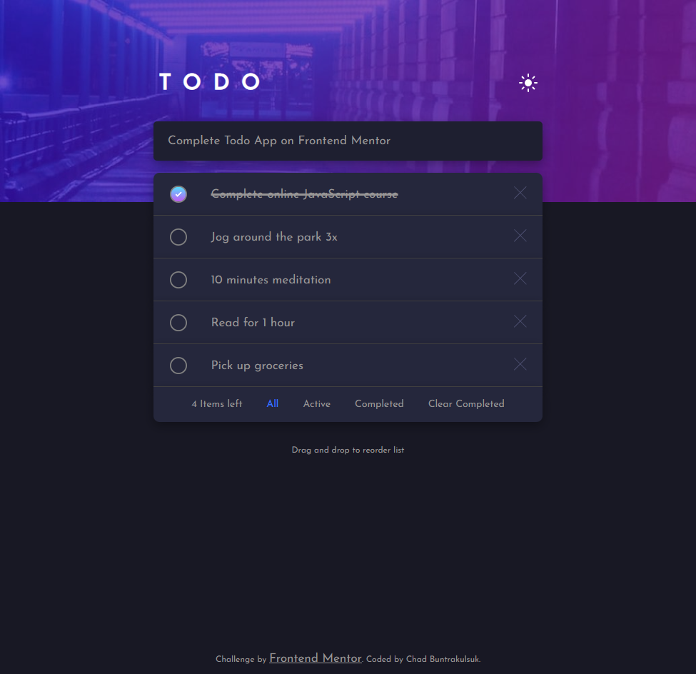

# Frontend Mentor - Todo app solution

This is a solution to the [Todo app challenge on Frontend Mentor](https://www.frontendmentor.io/challenges/todo-app-Su1_KokOW). Frontend Mentor challenges help you improve your coding skills by building realistic projects.

## Table of contents

- [Overview](#overview)
  - [The challenge](#the-challenge)
  - [Screenshot](#screenshot)
  - [Links](#links)
- [My process](#my-process)
  - [Built with](#built-with)
  - [What I learned](#what-i-learned)
  - [Useful resources](#useful-resources)
- [Author](#author)

**Note: Delete this note and update the table of contents based on what sections you keep.**

## Overview

### The challenge

Users should be able to:

- View the optimal layout for the app depending on their device's screen size
- See hover states for all interactive elements on the page
- Add new todos to the list
- Mark todos as complete
- Delete todos from the list
- Filter by all/active/complete todos
- Clear all completed todos
- Toggle light and dark mode
- **Bonus**: Drag and drop to reorder items on the list

### Screenshot

### Links

- Live Site URL: [Todo App](https://cbuntrakulsuk.github.io/Todo-app/)

## My process

### Built with

- Semantic HTML5 markup
- CSS custom properties
- [React](https://reactjs.org/) - JS library

### What I learned

This was my first project using react to build out the site, I learned a lot more about javascript and utilzing the map and filter functions and how to structre a web app using components. The biggest struggle I encountered was preserving the data of the array after applying a filter. The article below help me understand how to conditionally render each filter and preserve the original array by maping over the array and apply the filter when it renders.

### Useful resources

- [Filtering and Conditonal Rendering](https://developer.mozilla.org/en-US/docs/Learn/Tools_and_testing/Client-side_JavaScript_frameworks/React_interactivity_filtering_conditional_rendering) - This helped me for understand how to implement the filtering on the array.

## Author

- Website - [Chad Buntrakulsuk](https://github.com/cbuntrakulsuk)
- Frontend Mentor - [@yourusername](https://www.frontendmentor.io/profile/yourusername)
